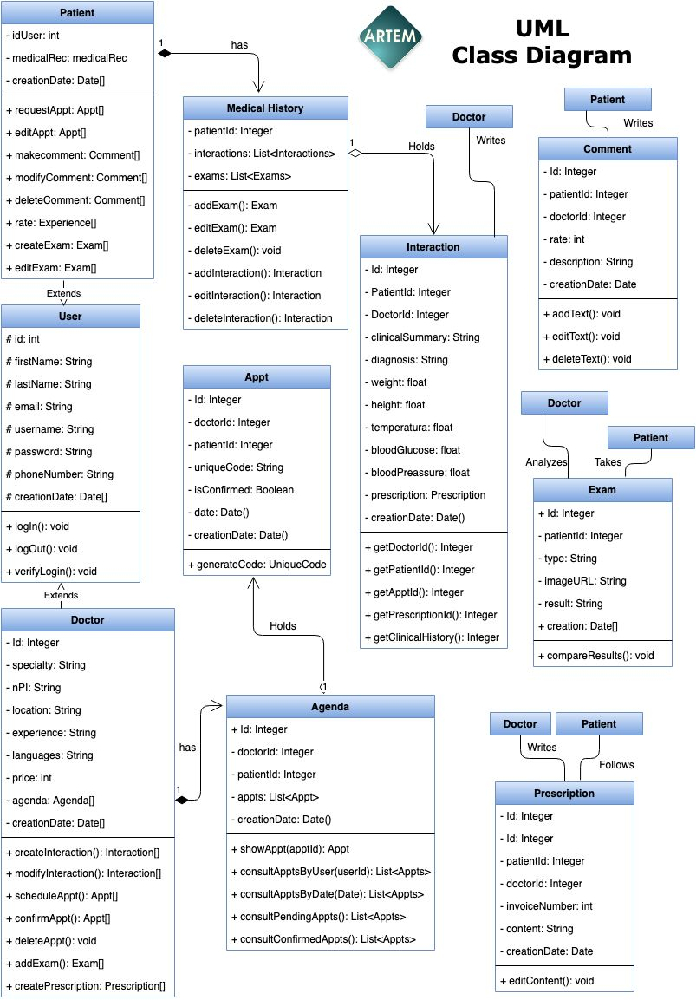

## ARTEM
Artem is a Web Application to connect physicians with patients, giving them a way to quickly find a doctor according to their needs.

## Presentation

#### Introduction
Currently, the world population is increasing, and also the need for medical care,
it is important to find a doctor that fits perfectly according your needs and sometimes it becomes hard to find the perfect one for you,
we face then an urgency to find a way to find the doctor we need in an easy, practical and efficient way.

#### Justification
Meet the patient's need to find a doctor and the doctor's to offer their services

#### Objective
Provide an online platform service in which the patient can schedule an appointment with a doctor of their choice.

#### What it is
It is a web application that is in charge of connecting specialist doctors with patients.

#### Technologies Implemented
- Front-end (React.js, Bootstrap, Javascript, CSS, HTML)
- Back-end (Spring Boot, Apache, Tomcat, Hibernate, Java, Maven)
- DataBase (MySQL)

#### How it will work
- There will be two profiles: Doctors and Patients
- A patient can login and search the database, according to specialty, location and qualification
- The patient will schedule an appointment
- The patient will be able to comment and rate the medical care recieved
- The doctor will be able to manage their available schedules to offer and confirm appointments.

#### Advantages
* Patient will have information from many doctors and experiences from their previous patients
* Decrease the time spent in searching
* Making the appoint emnt in a more practical way
* Going through the process from the comfort and portability of their computer.

## User Stories
- As a doctor I need an application where I could register with first and last name, email, username, password, specialty, NPI,
location, phone number, profile picture, experience, languages, prices, agenda.
- Me as user, I would be able to login to the application using an username and password, keeping my session open for a while and having access to my information.
- As a patient I need to register with first and last name, email, phone number, username and password.
- As a patient I would be able to search for doctors by specialty, name and/or location. Once I found a doctor I would be able to request and edit appointments, once approved and completed the appointment, I would be able to rate and tell my experience with the doctor.
- As a patient I need to have a medical record on my profile, so I can upload medical studies such as X-ray, lab results, etc. and It needs to be private for it to be accessible only by the doctor that I'm having an appointment with and me, having a unique code to share with my doctor.
- As a doctor I am going to be able to review the appointment request and cancel, edit or confirm them accordingly.
- As a doctor I need to have the option to use the unique code from my patient and have access to their medical record, where I can review previous interactions and add my own, with at least:
  + Patient's name
  + Date and time of submission
  + Doctor's NPI
  + Doctor's Specialty
  + Clinical summary
  + Medical prescription
  + Diagnosis
  + Weight
  + Height
  + Temperature
- Also as a doctor I need to place a request for the patient to enter their lab results or any other medical analysis.

## UML Class Diagram

